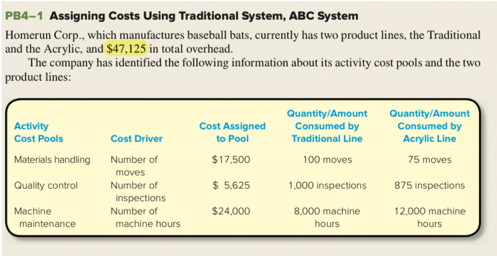

---
title:
  - "ACCTG 2200: Q&A Ch. 4"
author:
  - Dr. Morris
institute:
  - HKUST
---

# Do we always prefer products with higher profit margin?

- Yes
- ... but it's never that simple:
- Food \& Beverage pricing
  - Coffee vs Pastries
  - Alcohol vs Food
- Promotions
- The market may not support more of the high margin product
  - Scarcity may be part of the appeal
- Limits on production
  - i.e. Rolex

# Activity rate and activity proportion are equivalent

- Use the one that's easier/more useful in your situation

# When to use ABC vs. VBC

- When overheads are high relative to total costs
- When there are:
  - multiple products
  - multiple processes consumed differentially by the products  
  - AND/OR various departments participate in more than one process
- Test!

# How do we pick cost drivers

1. Pick activity pools
2. Use those to motivate the driver
3. Driver should cause the cost

# Adjustment of under/over-applied overhead in ABC?

Exactly the same as other systems:

1. Apply overhead
2. If there is a balance in MOH:
3. Adjust COGS at the end of the period
  - Drivers don't matter for the adjustment.
  - We are basically treating under/over applied overhead as a period costs

# Activity rate and activity proportion

- Same thing different form.
- Use whichever is most handy

# Batch-, product-, unit-level activities

- __Product-level__ activities vary with the number of __products__
  - Example: Design
  - You do it once for each product. (loosely)
  - A company sells several t-shirt designs
- __Batch-level__ activities vary with the number of __batches__
  - What is a batch?
    - A group of units that are produced together
    - Batch size varies with complexity, order size, production process, factory size
    - Usually some set up is required for a group of units
  - Each time the t-shirt company makes a set of t-shirts they have to set up the screen printing equipment with the design.
- __Unit-level__ activities  vary with the number of __units__
  - This is the cost of _actually making_ each t-shirt

# Difference between JIT and Job Order Costing

- Just-in-time inventory is not a 'costing' method
- Just-in-time inventory is an inventory management method which requires precise coordination between activities
- The link to ABC is that both require well developed information systems, and compliment each other.
- JIT is most common with _process_ costing and is not common with job order costing.
  - It is difficult to optimize a production process that changes for each job.

# What is the difference between Volume-based and non-Volume-based cost drivers?

- Volume based have a __direct__ relationship to the number of customers served or units produced
  - Product- and batch-level drivers _do not_ vary _directly_ with the number of units produced.
