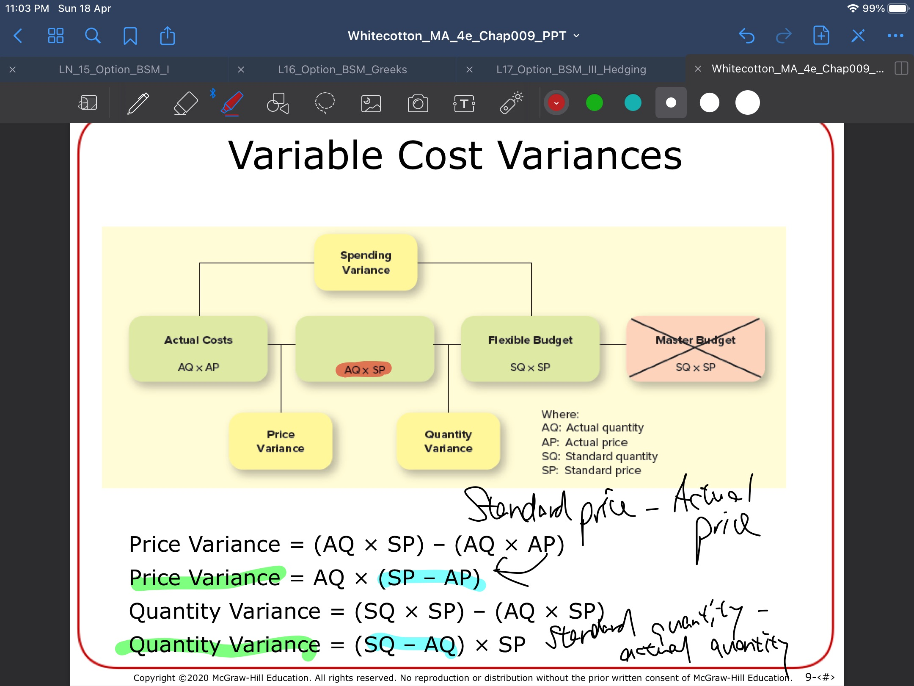

---
title:
  - "ACCTG 2200: Q&A Ch. 8 & 9"
author:
  - Dr. Morris
institute:
  - HKUST
---

# Q: Where does AQ x SP come from?

# A: This graph (and the algebra slides)

# What is the purpose of the budget?

1. A master operational and financial plan for the company
  - Timing of purchasing, production, and financing.
  - Errors in either direction can be problematic.
2. Many of the things we measure for the budget may be useful for compensation
  - However this should be done with care.
  - Compensation based on the budget can lead to
    1. Overproduction
    2. Overly aggressive cost-cutting
    3. Dishonest sales practices
    4. Distorted budgeting
      - Both slack and overly optimistic budgets
3. [Prioritize honest clear communication over high-powered incentives.](https://www.gsb.stanford.edu/insights/incentives-employees-just-time-settings)

# Budgets at Job-Order Firms

- Remember, a budget is a production and financing plan.
- Each job will have it's own budgets for direct materials, overheads and labor.
- The master budget will summarize these and add financing.

# Are there times when a firms wouldn't want to budget?

- No.
- A budget is just a plan, so no matter how informal, it's nearly impossible to function without planning.
- There is an extensive discussion on the forum of the things that can go wrong if budgets are not properly designed.

# What about budgets for non-manufacturing portions of manufacturing firms?

- Separate divisions can be budgeted separately on the operations side and then financed together.
- Merchandising and Service can be incorporated into the SG&A portion of the budget.

# Feedback on the case assignment:

## 3 dimensions of assessment:

1. Logic
  - State the problem clearly, match the solution to the problem.
2. Originality
  - Common ideas: brick and mortar, influencers, social media, mens.
  - Specificity helps - recommend actual steps.
3. Clarity
  - Try to say a few things well.
  - Avoid word salad.

Example: Lululemon may lose market share to Dick's. Expand men's line. Use focus on men's wellness to grow and maintain market share.

_Common themes, but with very specific points about both the problem and the solution._
